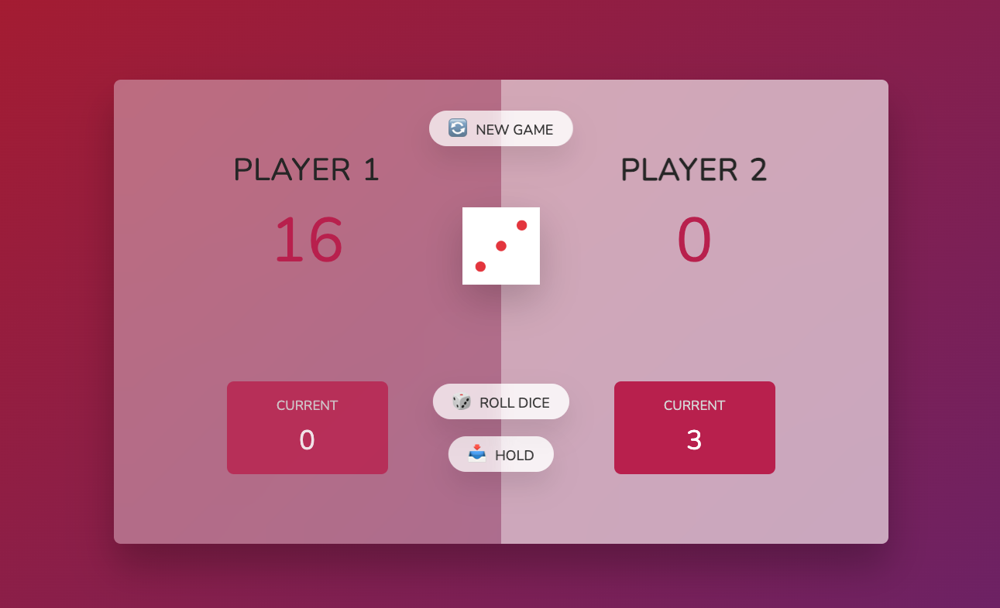
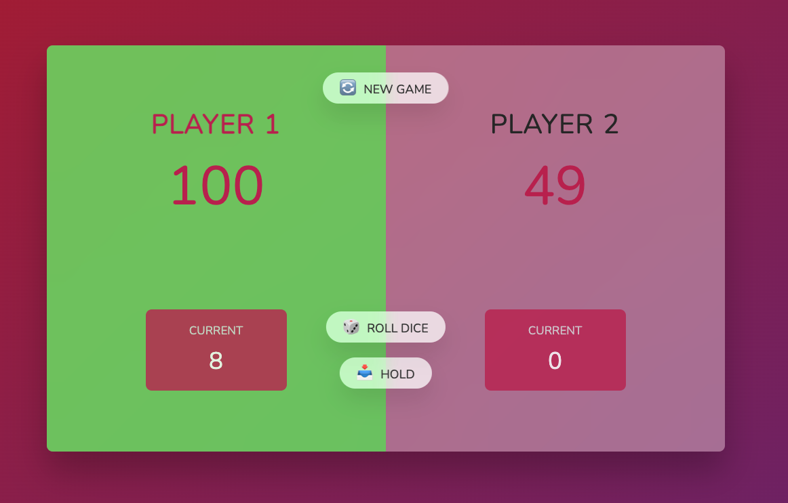
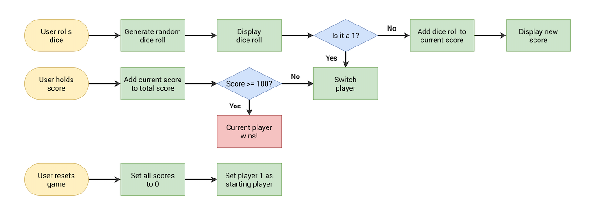

# 🎲💯 WebSite-FirstTo100 🎲💯

> Turn based 2 person dice game. Roll the dice as many times as you want and keep adding them to your score to be the first to get to 100 but don't get greedy... Rolling a 1 will reset your partial score back to 0 and give the turn to your oponent. 

> Live demo  ==>  Working on it, still not live at the moment.

## Table of Contents
* [General Info](#general-information)
* [Technologies Used](#technologies-used)
* [Screenshots](#screenshots)
* [Setup](#setup)
* [Project Status](#project-status)
* [Room for Improvement](#room-for-improvement)
* [Acknowledgements](#acknowledgements)
* [Contact me](#contact-me)

## General Information
Simple web based game intended as a personal challenge in the initall stages of my web development journey.  

## Technologies Used
- HTML
- CSS
- JavaScript

## Screenshots

## Setup
Given that the project is not yet hosted on a server you'll have to download this repository's contents to your computer and open the file index.HTML with the browser of your choice. 

## Project Status
Project is fully functioning and finished.

## Room for Improvement
Functionality wise the game will always be what it is, regarding the UI/UX it could always be better and more refined.

## Acknowledgements
- This project was based on a challenge found on [this course](shorturl.at/dG289).
- Many thanks to Jonas Schmedtmann and it's great teaching

## Contact me

